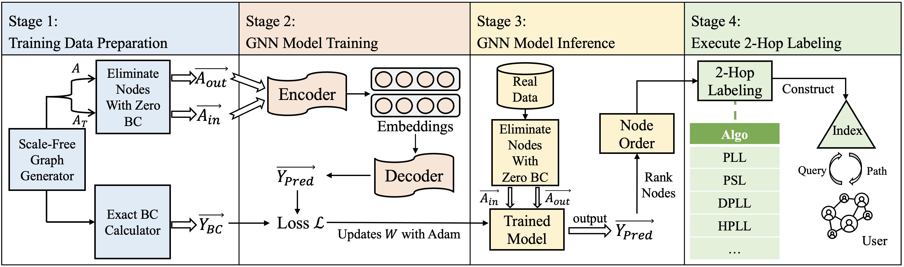

# PathBee: A Generic, Plug-and-Play Optimization Framework for Distance Labeling Algorithms (SIGMOD 2026)

This repository hosts the source code and supplementary materials for our SIGMOD 2026 paper, "A Generic, Plug-and-Play Optimization Framework for Distance Labeling Algorithms". This work presents PathBee, an innovative framework leveraging Graph Neural Networks (GNNs) that significantly advances the current 2-hop labeling-based approaches.

## PathBee Workflow

Our workflow is comprised of four key stages:

1. **Training Data Preparation**: We generate synthetic scale-free graphs using the NetworkX library, and then annotate the data using an internal tool that calculates precise centrality values.
2. **GNN Model Training**: We use the prepared datasets to train our GNN model.
3. **GNN Model Inference**: This stage is dedicated to predicting Betweenness Centrality (BC) values.
4. **Execute 2-Hop Labeling**: We utilize the predicted BC values to sort nodes and execute the 2-Hop Labeling algorithm.



## Code Structure

```sh
PathBee
├── 2_hop_labeling              # Folder for 2-hop labeling algorithm
├── datasets                    # Folder for data-related files
├── launch.py                   # Script to launch the application
├── models                      # Folder for storing model files
├── pathbee                     # Main folder for core algorithms and functions
│   ├── algorithms              # Folder for algorithm-related code
│   └── gnn                     # Folder for GNN-related code
```

## Quick Start

### Step 0: Prerequisites

Ensure you're running Python 3.10 or higher. Install the necessary packages with:

```sh
python create -n pb python=3.10

pip install torch==1.12.1+cu113 torchvision==0.13.1+cu113 torchaudio==0.12.1 --extra-index-url https://download.pytorch.org/whl/cu113

pip install -r requirements.txt
```

To execute the 2_hop_labeling, you need to have GCC 11.3.0 or above installed.

### Step 1: Training Data Preparation

```sh
# Create training and test datasets
python launch.py gen 
```

### Step 2: GNN Model Training

```sh
# Train the GNN model for betweenness centrality
python launch.py train
```

### Step 3: GNN Model Inference

```sh
# Run GNN model inference to predict BC values
python launch.py cen --graph-path <graph_file> --centrality gnn_pb --model-path <model_path>
```

### Step 4: Execute 2-Hop Labeling

```sh
# Compile the 2-Hop Labeling algorithm
python launch.py index --graph-path <graph_file> --centrality-path <centrality_file> --index-path <index_file>
```

## Performance

### Baseline

PathBee is a general framework that can be used with various 2-hop labeling algorithms. The central component shared among these algorithms is the pruned index construction procedure. This repository demonstrates the effectiveness and versatility of PathBee by applying it to the representative offline 2-hop labeling algorithm, PLL [1], within the pruned index construction procedure. For in-depth insights into PathBee's integration with different algorithms, please refer to our paper for detailed information.

### Setup

For experiments in a single-core CPU environment, we use a Linux server with AMD Ryzen 7 3700X (3.6 GHz) and 128 GB of main memory. For experiments in a multi-core CPU environment, we use a Linux server with Intel(R) Xeon(R) CPU E5-2696 v4 (2.2 GHz, 80 cores) and 128 GB of main memory. The cut-off time is set to 12 hours.

### Effectiveness of PathBee on PLL

We conducted a comparison of the index construction time, index size and query time between PLL, PathBee, and PathBee+ on 26 real-world datasets.

The performance comparison result is shown as below.

#### Comparison on Index Construction Time

<div align=center></div>

#### Comparison on Index Size

<div align=center></div>

#### Comparison on Query Time

<div align=center></div>

### Scalability of PathBee

In the experiment for scalability validation, we randomly divide vertices of a graph into 5 equally sized vertex groups and create 5 graphs for the cases of 20%, 40%, 60%, 80%, 100%: the 𝑖-th graph is the induced subgraph on the first 𝑖-th vertex group.

The scalability validation result is shown as below.

#### Scalability Tests

<div align=center></div>

<div align=center></div>

### Traversal Cost Model Validation

The extra traversal cost model validation result (section 4 in our paper) is shown as below.

<div align="center">
  
  
</div>

<div align="center">
  
  
</div>

## References

[1] [Pruned Landmark Labeling](https://github.com/iwiwi/pruned-landmark-labeling)
[2] [Historical Pruned Landmark Labeling](https://github.com/iwiwi/historical-pruned-landmark-labeling)
[3] [GNN-Bet](https://github.com/sunilkmaurya/GNN-Bet)
